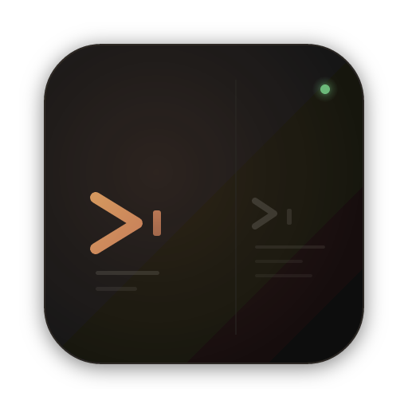
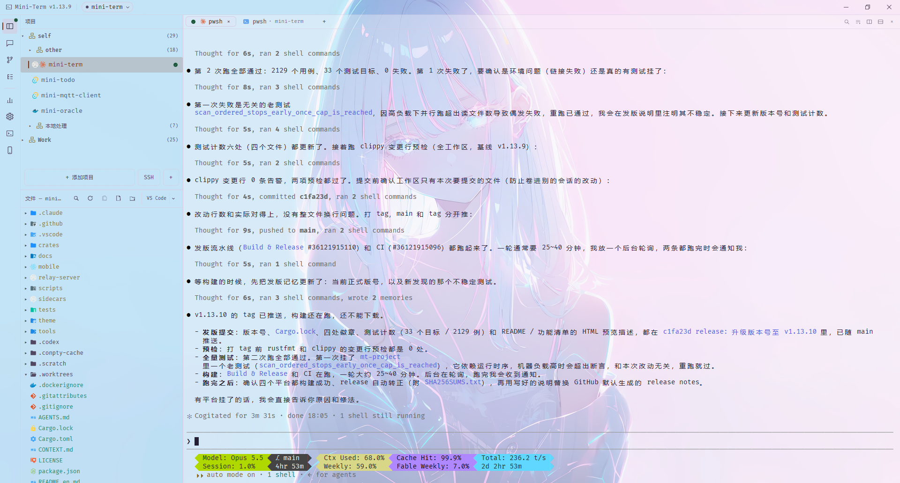

<p align="center">
  
</p>

<h1 align="center">Mini-Term</h1>

<p align="center">
  <strong>为 AI 时代打造的桌面终端管理器</strong><br>
  多项目 · 多标签 · 递归分屏 · AI 状态感知 · SSH 远程 · Git Worktree · 手机远程看 AI
</p>

<p align="center">
  <strong>简体中文</strong> · <a href="README.en.md">English</a>
</p>

<p align="center">
  
  
  
  
  
</p>

<p align="center">
  <a href="https://github.com/dreamlonglll/mini-term/releases">下载安装包</a> ·
  <a href="docs/features.zh-CN.md">完整功能清单</a> ·
  <a href="docs/deploy-relay.zh-CN.md">中转部署</a>
</p>

> **GPUI 原生版是当前唯一形态**：Rust 原生渲染、单进程、不依赖 WebView2。早期的 Tauri + React 实现已于 v1.0.0-beta 后从仓库移除并停止发布（历史版本安装包仍可在旧 Release 下载，源码看 git 历史）。

---

## 一个场景

你同时开着 4 个 Claude Code 会话，分散在 3 个项目里。**哪个跑完了？哪个卡在等你确认？** 系统终端不会告诉你，只能一个个点开看；为这点事去开 VS Code / IDEA，又是几百兆内存换一个终端窗口。

Mini-Term 就是为这件事做的：项目列表上的状态灯实时跳动，AI 一跑完立刻弹提醒、任务栏闪烁、响一声；出门在外掏出手机，看到的是同一份现场，还能直接发下一条指令。



---

## 八个最值得一试的地方

### 🔔 AI 跑完了，你第一时间知道

不靠猜进程名——直接接入 **Claude Code / Codex / Grok Build 官方 Hook API**，事件实时上报，比轮询更准更快（进程轮询作为降级兜底保留）。设置里按 CLI 勾选注册 / 卸载 Hook，只用其中一家就不会被写入另外两家的配置，写入时合并而不是覆盖。

状态从「面板 → 标签页 → 项目」逐层聚合，任务转为完成的瞬间触发四件事，每一项都能单独开关：

- 右下角 Toast 通知（只对非活跃项目弹，同项目自动去重）
- 项目列表 **DONE** 徽章
- 任务栏闪烁（Windows）/ Dock 跳动（macOS），仅窗口失焦时触发
- 提示音（内置合成音，也可以换成你自己的音频文件）

AI 停下来**等你批工具权限**、等你填 MCP 表单，或这一轮因 API 错误结束时，同样走这套提醒（Toast 换成警告色，不发 DONE 徽章）——它比「跑完」频繁得多，可以单独关掉。窗口切走之后由**状态栏图标**接力（黄=待确认、蓝=处理中、绿=完成未读、灰=安静）：左键点一下直接落到最该处理的那个会话，右键列出所有进入 AI 会话的项目及各自状态。

徽章不会卡住：`Stop` 不触发的那些情形（回合因 API 错误结束、你按 Esc 打断）已按官方事件逐个补齐；再兜一层「状态与终端输出双双静默 10 秒就摘徽章」。兜底结论一次写定、不会来回摆动，所以不会重演早期版本那种「同一个任务每隔二三十秒播报一次完成」。

**Grok Build** 与 Claude / Codex 同档接入，状态、镜像、历史与统计全都有。**opencode / pi** 则靠识别你敲下的命令认出来，状态灯、完成播报与手机端发指令照常可用；只是这两家没有可解析的会话记录，对话镜像、AI 历史面板与用量统计对它们是空的。

### 📱 出门在外，用手机看桌面上跑着的 AI

这大概是 Mini-Term 最不一样的地方。

顶栏「移动端」面板填好中转地址 → 保存并连接 → 生成配对二维码，**手机相机一扫就进 PWA 自动配对**。之后你在外面能：

- 看**按项目分组的活跃 AI 会话列表**，状态灯与桌面端实时同步
- 点进任一会话**实时看对话镜像**，Markdown 渲染，往上滚分页加载更早的消息
- 在底部输入框**直接发指令**，等价于你本人在桌面键盘上敲下并回车，带即时回执
- **从手机发起一个全新会话**：选项目 → 选 AI 启动器，桌面端后台把 agent 拉起来
- 给会话**改个看得懂的名字**，同步显示到桌面端的标签上

安全边界是认真设计过的：配对码一次性有效（10 分钟），新设备配对自动顶替旧设备，「重置配对」立即吊销全部凭证；**中转服务器只转发不落盘**，日志仅留元数据；AI 启动器的**命令文本从不经过手机或中转**，手机只按 id 引用、只看得到名字。

> **前提**：中转要跑在**你自己的**服务器上（1C1G 足够，Docker 一条命令起，另需一个解析到它的域名做 TLS）。这是刻意的设计——没有任何第三方服务掺在中间。见[部署文档](docs/deploy-relay.zh-CN.md)。

### 📊 这个月 AI 花了多少钱，一眼看到

顶栏「统计」打开使用统计面板：Claude Code / Codex / Grok 的**成本、调用、会话数**多维聚合，按日 / 按小时趋势图，模型、项目排行与 Top 会话，范围和口径随手切。

数据从本地会话记录解析进 **rusqlite 账本**——面板毫秒级出数，后台增量同步补新账；fork 复制出来的历史**不会重复计费**，缓存读写按官方价差精确计价。价格表每天从 models.dev 拉一次（只读公开价目，**不上传任何用量数据**），拉不到就用缓存，绝不拿假数据糊你。

### 🔁 重启不断线：AI 会话自动续接

关掉 Mini-Term 再打开，上次每个分屏里跑着的 Claude / Codex / Grok 会**自动 `--resume` 续回原会话**——会话身份来自 hook 上报、随布局一起持久化。写回终端前有白名单校验兜底：识别不了的一律不写，远程 pane 不参与，宁可不续也不敲错命令。不想让它自己敲命令的，设置里一个开关关掉——终端照常恢复，只是不自动跑续接。

### 🧰 把你的 SSH 连接，变成 AI 能调用的工具

项目右键「关联 SSH」勾选连接即按项目启用，**可见范围就限定在你勾的那几个**。启用时生成 Claude / Codex 两份 `SKILL.md`（内嵌 CLI 绝对路径与该项目的随机能力令牌）——agent 按需加载 skill，不再有一份工具 schema 常驻上下文；调用的是普通命令行，可以和 `grep`、管道、重定向自由组合。

内置 `mt-ssh-cli` sidecar 提供 `list` / `exec` / `upload` / `download` 四个子命令：远程 stdout / stderr 与退出码**原样流式透传**，上传下载走 **SFTP 分块流式传输**（内存恒定、能传大文件），认证凭据始终留在本机，每次调用写审计日志。**每条命令都必须带项目令牌**——缺失、未知或属于已停用项目的一律拒绝，绝不回退成「能看见全部连接」。背后是**全机单例 daemon** 持有的持久连接池：首次调用自动拉起并完成握手认证，之后每条命令只花一个 RTT，空闲 10 分钟自退；daemon 不可用时降级为进程内直连，输出与退出码契约完全一致。还有一条硬护栏——拒绝传输 mini-term 自己的 `config.json`。

> 过渡期 `mt-ssh-mcp` MCP sidecar 仍随安装包发布，计划下个周期下线。

### 🌐 远程目录当本地项目用，WSL 也一样

- **SSH 远程项目** — 服务器上的目录直接添加成项目：文件树经 SFTP 懒加载，终端 `ssh -t` 直连并自动落到项目目录，断线后覆盖层一键重连，远程机器上的 Claude / Codex 历史会话也能读出正文。远程缓存键掺入连接 id，两台服务器上的同名路径不会串数据
- **WSL 支持** — `\\wsl$\<distro>\<path>` 直接当项目根，自动改用 `wsl.exe --cd` 启动，`pwd` 真的落在 WSL 里而不是 `C:\Windows`；Windows 下还能直接读 WSL 发行版内的 Claude / Codex 会话历史

### 🪟 多项目 · 递归分屏 · 会话历史

- **左侧项目列表**管理多个工作区，支持最多 3 级嵌套分组、拖拽排序、从资源管理器拖文件夹直接添加
- **横竖任意嵌套的递归分屏**，拖拽调比例；标签 / 分屏 / 窗口大小位置全部持久化，重启原样恢复
- **项目级终端面板**——终端区右缘的图标竖条给同一项目开多个**独立终端工作面**，各自持有整套分屏与标签互不影响（跑 AI 的一面、跑前后端的一面，点图标整面切换）；按钮带 AI 进度呼吸灯与终端数角标，双击改名，全部随重启还原
- **换场动画**——切标签 / 切面板按方向推入推出，最大化从终端所在格子展开到整幅、还原反向收回；不喜欢动画的，设置里一个开关整体关掉
- **pane 拖拽重排与最大化**——tab 拖到别的分组并入，拖到终端区四边分出新屏，落点实时高亮预览；双击 tab 栏空白处把当前分组临时铺满，终端内容全程不丢
- **终端缓存**——切项目、切标签、切分屏都不重建终端实例；启动按需懒加载，只给可见的 pane 建 PTY，历史项目再多也不拖慢启动
- **滚动缓冲行数可调**（默认 1 万行，改小当场生效并释放内存），正确处理 CSI 3J；Windows 版内置固定版本官方 ConPTY 运行时
- **AI 会话历史**——读本地 Claude / Codex / Grok 记录，右键复制恢复命令快速续接，也能直接看完整对话正文（Markdown 渲染 + `Ctrl+F` 搜索）
- **AI 会话分支树**——pane 右键「分支会话到新分屏」：原会话原地继续跑，旁边的新 pane 里是复制出来的分支。历史面板可切「分支树视图」，fork 出的会话按缩进连线挂在父会话下，正在跑的节点带状态点；点任意节点——已开的切过去聚焦，没开的新终端自动恢复
- **AI 任务标记**——会话里每次按 Enter 自动打点，`Ctrl+Shift+↑/↓` 在历史提交之间跳转

### 🌿 Git 集成 + Worktree 批量管理

VS Code 风格的 **Changes 面板**（Staged / Changes / Untracked 分组，单文件或全量 stage / discard，`Ctrl+Enter` 提交），并排 / 内联双视图 Diff（长行横向滚动、两栏纵向同步、`@@` hunk 分隔与「上一处 / 下一处改动」跳转，配对上的删 / 增行再做词级高亮），游标分页的提交历史，以及**手绘 SVG 分支拓扑图**。Git 面板为上下两个可折叠区块——更改在上、提交历史在下，同屏可见、中缝拖拽调比例；顶部仓库栏下拉切换仓库，分支徽章一键切换历史查看分支（不 checkout），刷新 / Pull / Push 也收在栏上。

**Worktree 管理**对多 Agent 并行开发特别有用：项目根目录本身不是仓库时会**向下扫描子仓库**并按主工作区归并，组头可勾选多选 / 全选，**一次为每个勾选的仓库各建一个 worktree**。建好的 worktree 可以一键「设为项目」挂到主项目下面，或者直接开个终端进去。**AI agent 在终端里把 worktree 删掉之后**，回到窗口时列表会自动把目录已消失的子项目连同终端资源一起收掉，不留失效条目。

---

## 还有一堆为「跟 AI 一起工作」调过的细节

| | |
|---|---|
| **长文本粘贴** | 剪贴板 ≥10 行或 ≥2000 字符时自动转存临时 `.txt`，粘贴带引号的路径——AI 工具不必硬吞超长内容 |
| **图片粘贴** | 剪贴板里有截图自动检测，存成临时 PNG 并粘路径，兼容 PinPix 等非标准格式 |
| **远程自动落地** | 上面两种粘贴在 SSH 远程项目里会经 SFTP 传到远端再粘**远端**路径；WSL 项目自动把 `C:\...` 换算成 `/mnt/c/...` |
| **文件拖拽** | 从文件树或资源管理器拖文件到终端，插入带引号的绝对路径，精准落到目标分屏 |
| **内置文件编辑器** | 文件树点开即改：tree-sitter 语法高亮（30+ 语言），查找替换，`Ctrl+S` 原子落盘，外部改动自动感知 |
| **带图的文档预览** | Markdown / HTML 预览里的图片真的会显示——相对路径按文件所在目录解析，网络图直接拉回来（10s 超时 + 32MB 上限，其余协议一律拒）。HTML 另有一个「用浏览器打开」，走 https 协议关联而不是 `.html` 的文件关联 |
| **全局搜索** | `Ctrl+Shift+F` 唤起，文件名 / 内容双模式，子串或正则，后端流式推送随时可取消 |
| **项目级环境变量** | 按项目注入 PTY 子进程，严格 POSIX 校验，Rust 端二次防御，WSL 下经 WSLENV 透传 |
| **智能 Ctrl+C/V** | 可选开启：有选区时复制、无选区时中断程序；Windows 大段粘贴自动分块防 ConPTY 丢行 |
| **满屏图标** | 文件树按文件名给一枚专属图标、目录按名换图（Material Icon Theme 官方图 263 枚），项目行 AI 品牌图标与 51 种技术栈徽标（devicon 官方 logo）。官方 SVG 的几何与配色原样烘焙，原生自绘渲染 |
| **拖选停留自动复制** | 拖选后按住鼠标静止超过设定时长自动复制选区并弹「已复制」气泡，时长可调（0 = 关闭） |
| **项目描述** | 右键给项目补一行灰色小字备注，一排 worktree 子项目各自在干什么一眼分清 |
| **启动零网络请求** | 原生渲染无 Web 资源，启动不发任何网络请求（价格表按天拉取，拉不到用缓存） |
| **刷屏不卡界面** | PTY 字节在后台线程直喂 VT 状态机、UI 按帧取格子渲染——单进程零 IPC，没有中间缓冲可堆积，`cat` 大文件也拖不垮界面 |
| **终端连体字** | 一个开关，`=>` `!=` `->` 按字体的连字规则合并显示，逐列对齐不受影响。注意默认的 Cascadia **Mono** 是去连字版，得换 Cascadia Code / Fira Code 才看得见效果 |
| **三种主题** | Auto / Light / Dark（暖炭色调）；标题栏与主题同色，启动无浅色闪烁 |
| **外置主题包** | 兼容 Dream Skin 格式的皮肤：文件夹或 zip 导入、manifest 的 sha256 校验、改文件即热重载；皮肤可自带背景图，终端随之透明化压在氛围层上。外链一律走同一道闸（禁 `@import`，指向包外的引用全拒）。点「生成示例」落一份可直接改的示例皮肤到皮肤目录 |
| **自定义标题栏** | 无边框窗口 + 自绘标题栏，配色跟着主题走；Windows / Linux 右侧三键并保留 Win11 贴靠布局，macOS 保留原生交通灯。版本号旁是**当前项目切换器**，全局状态灯紧随其右，点一下直接跳到下一个该处理的会话 |
| **项目行悬停预览** | **只对跑着 AI 会话的项目弹**：悬停 250ms 弹出该项目终端区的**微缩布局拼图**，按分屏树等比复现真实排布，打开期间 500ms 重画所以是活的；隐藏 tab 以「+N」徽章示数并附最高优先级状态点。非激活的 pane tab 悬停也弹单格缩略图 |
| **中英双语** | 一键切换全界面实时重渲染，首次启动按系统语言探测，自研轻量 i18n 无额外运行时依赖 |
| **设置面板分组** | 侧栏两级菜单：终端、外观、AI、系统，每页只剩一屏，不用滚半页找开关 |

---

## 技术栈

整套应用为 **Rust 原生实现**（早期 Tauri + React 版已移除，源码看 git 历史）：

| 层 | 实现 |
|---|---|
| 壳 / 渲染 | GPUI 0.2（Zed 同源框架，GPU 原生渲染，单进程、无 WebView） |
| UI | 纯 Rust：gpui-component + 自绘组件 |
| 终端 | alacritty_terminal（进程内 VT 解析，零 IPC、零序列化）· portable-pty |
| 状态 / 布局 | 单一 Store · 递归 SplitNode 分屏树 |
| 配置 / 布局持久化 | rusqlite（`config.db` 配置本体 · `layout.db` 界面布局） |
| Git / 文件 | git2（libgit2）· notify + ignore |
| 用量统计 | rusqlite 本地账本 · 自绘趋势图 |
| 移动端中转 | axum + tokio WebSocket（`relay-server/`）· React + Vite PWA（`mobile/`） |
| 测试 | **1540 个 Rust 测试**（28 个测试目标） |

---

## 快速开始

### 下载安装

前往 [Releases](https://github.com/dreamlonglll/mini-term/releases) 下载，三平台产物：

- **Windows x64（主要支持平台）** — `mini-term-gpui-*-windows-x64-setup.exe` 安装包（NSIS，用户级安装免管理员；装过旧版的默认原目录升级，且**先卸载旧版再装**而不是文件覆盖写）
- **macOS arm64** — `mini-term-gpui-*-macos-arm64.dmg`
- **Linux x64** — `mini-term-gpui-*-linux-amd64.deb` 或 `mini-term-gpui-*-linux-x64.tar.gz`

> **平台支持**
> - **Windows** — 主要支持平台，保证可用性，日常开发与测试都在 Windows 上
> - **macOS / Linux** — 代码层面已支持，但**可用性欠佳**、未经充分打磨，欢迎提 Issue

macOS 首次打开若提示 "is damaged and can't be opened"，是因为 Release 产物没有 Apple Developer ID 签名被 Gatekeeper 拦下，不是文件真的坏了。拖进 `/Applications` 后执行一次即可：

```bash
xattr -cr /Applications/Mini-Term.app
```

### 从源码构建

需要 Rust >= 1.95；构建 sidecar 就位脚本需要 Node.js >= 20（仅标准库，无 npm 依赖）。

```bash
git clone https://github.com/dreamlonglll/mini-term.git
cd mini-term

node scripts/stage-sidecars.mjs      # 构建三个 sidecar 并连同便携 ConPTY 就位到 target/debug/
cargo run -p mt-app                  # 开发
cargo build --release -p mt-app      # 产物 target/release/mini-term(.exe)
```

> hook 上报与便携 ConPTY 按「与 exe 同目录」定位 sidecar 与资源，发布包已带齐；源码运行要完整体验，先跑一次 `stage-sidecars.mjs`（release 构建对应 `--release`，就位到 `target/release/`）。

---

## 更多

- 📖 **[完整功能清单](docs/features.zh-CN.md)** — 每一项功能的详细说明、架构概览与边界条件
- 📱 **[中转服务部署文档](docs/deploy-relay.zh-CN.md)** — 手机远程功能所需的自托管中转
- 🐛 **[提 Issue / PR](https://github.com/dreamlonglll/mini-term/issues)** — 外部贡献会经过功能验证和安全审查后合并

学 AI，上 L 站 — [LinuxDO](https://linux.do/)
